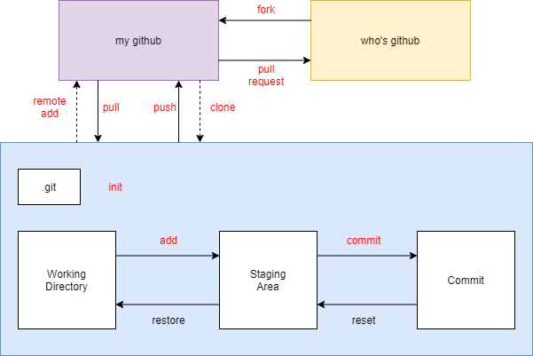

## git command

> 기본 명령어를 정리합니다.



##### init

.git 폴더를 만들어주기 위한 명령. 한번만 수행

- 사용법

```bash
git init
```


##### add

working directory 에 있는 파일을 staging area 에 올리는 명령어

- 사용법

```bash
git add <file name>
```


##### commit

staging area 에 있는 파일들을 하나의 commit 으로 저장하는 명령어

- 사용법

```bash
git commit -m "message"
```

- 가장 최근의 커밋 메시지 변경
```bash
git commit --amend
```

##### remote

원격 저장소를 관리하기 위한 명령어

- add
- 원격 저장소 연결 추가

```bash
git remote add <remote name> <URL>
```


- remove
- 원격 저장소 연결 제거

```bash
git remote remove <remote name>
```


##### push

로컬에 저장되어있는 커밋들을 원격저장소에 업로드 하는 명령어

- 사용법

```bash
git push origin <branch name>
```


##### pull
원격 저장소에 저장된 커밋들을 로컬로 불러오기

- 사용법
```bass
git pull origin <branch name>
```


##### clone
원격 저장소 repository 를 로컬로 복제

- 사용법
```bass
git clone <repository url>
```


##### status

git의 현재 상태를 확인하는 명령어

- 사용법

```bash
git status
```


##### restore
staging area 에 위치한 파일을 제거  
기능이 더 있는 것 같은데 추가로 확인 필요.

- 사용법

```bash
git restore --staged <file name>
```

##### reset, revert
기능 테스트 필요.

