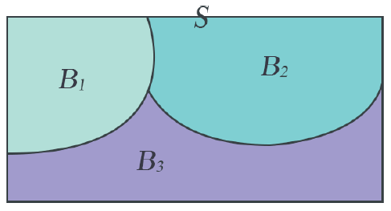
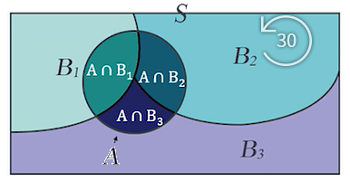

# 베이즈 정리
> 데이터라는 조건이 주어졌을 때의 조건부확률을 구하는 공식(결과가 주어졌을 때 원인의 확률)

### 분할의 조건
1. 각각의 원인은 동시에 일어날 수 없다.(상호배반)

2. 각각 원인의 합사건은 저체 표본공간이 되어야 한다.  
    (어떤 결과의 원인은 k개의 원인 중 하나여야한다.?)  
    (모든 가능한 원인이 포함되어 있어야한다.)

  

### 전환률공식
- k = 3 인 경우
-  $P(A) = P(A \cap B1) + P(A \cap B2) + P(A \cap B3) $  
   $P(A) = P(B1)P(A|B1) + P(B2)P(A|B2) + P(B3)P(A|B3) $ (조건부 확률 공식 적용)  
   

### 베이즈정리

