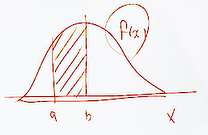
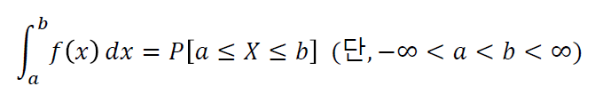

# 확률변수와 확률분포, 분포의 특성치

### 확률변수
- 표본공간에서 정의된 실수값 함수
- 표본공간의 원소에 실수를 대응시켜주는 함수
- 실수료 표현되는 사전의 결과
- 동전을 던진다
    - S = { H, T }
    - 동전의 앞면이 나오는 경우가 관심사
    - X = { 1, 0 } :: 앞면을 1로 설정
- 주사위 2개를 던진다
    - S = { (1,1), (1,2) ... (6,6) }
    - 두 수의 합이 관심사
    - X = { 2, 3 ... 12 }

- 이산형  
  : 확률변수가 취할 수 있는 값이 셀 수 있는 경우  
  : 고객, 사고건수, 불량 수 등

- 연속형  
  : 주어진 구간에서 모든 실수 값을 취할 수 있어 셀 수 없는 경우  
  : 시간, 길이, 온도, 무게 등

### 확률질량함수(Probability Mass Function)
- 확률변수가 이산형인 경우
- X 가 특정값일 확률을 정의하는 함수
- f(xi) = P[X = xi]
- 0 <= f(xi) <= 1

### 확률밀도함수(Probability Density Function)
- 확률변수가 연속형인 경우
- X 가 특정값일 확률은 구할 수 없지만
- X 가 어떤 구간에 포함될 확률을 정의할 수 있다
- X 가 a 와 b 사이에 포함될 확률을 높이 값이 아닌 넓이 값으로 구한다
- 
- 

### 누적분포함수(Cumulative Density Function)
- X 의 확률밀도 함수가 f(x) 일 때, X 의 누적분포함수는 F(x) 는 X <= x 인 모든 X 에 대한 f(x)의 적분값
- 입력된 x 보다 작거나 같은 값일 확률
- 특정지점까지 면적의 누적합계
- F(x) << 대문자
- x 가 증가하면 F(x) 도 증가

## 확률분포의 특성치

### 기대값(Expectation)
- 분포의 무게중심
- E[X]
- 뮤
- 모평균

### 분산(Variance)
- 분포의 산포
- V[X]
- 시그마제곱
- 분포가 얼마나 펑퍼짐한가
- 모분산
- 편차 제곱의 기대값

### 표준편차(Standard Deviation)
- 분산의 제곱근
- S[X]
- 시그마