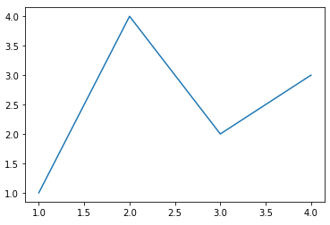
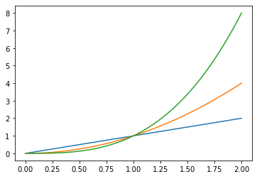

# matplotlib

> 시각화 라이브러리


### figure 에 

1. import

   ```python
   import matplotlib.pyplot as plt
   ```


2. subplots
   ```python
   fig, ax = plt.subplots()  # figure 와 하나의 좌표영역을 생성  
   ax.plot([1, 2, 3, 4], [1, 4, 2, 3]) # x, y 좌표를 플로팅
   ```
   


   ```python
   x = np.linspace(0, 2, 100)
   fig, ax = plt.subplots()
   ax.plot(x, x)     # 데이터 플로팅
   ax.plot(x, x**2)  # 추가 데이터 플로팅
   ax.plot(x, x**3)  # 계속 추가 가능...
   ```
   