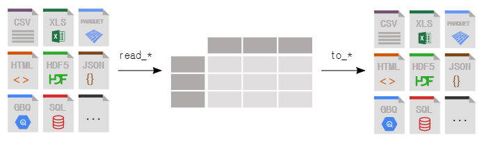

# Pandas

> 데이터 분석 및 조작


1. 데이터 타입
   - Series : 1차원 데이터
      - index : Series 에서 세로축 라벨
      - values : 데이터
      ```ptyhon
      pd.Series([10, 20, 30, 40, 50])
      
      out:
      0    10
      1    20
      2    30
      3    40
      4    50
      dtype: int64
      ```
   - DataFrame : 2차원 데이터
      - index : DataFrame 에서 세로축 라벨
      - columns : 가로축 라벨
      - values : 데이터
      ```ptyhon
      pd.DataFrame([[1,2,3],[4,5,6]])
      
      out:
      |      |  0   |  1   |  2   |
      | ---- | ---- | ---- | ---- |
      |  0   |  1   |  2   |  3   |
      |  1   |  4   |  5   |  6   |
      ```


2. 데이터 접근
   - iloc : 인덱스로 접근
   - loc : 인덱스 컬럼의 값으로 접근
   - values : 전체 데이터를 array 로 제공
   - info : 데이터의 정보 조회
   - head : 상위 N 개의 데이터 조회
   - tail : 하위 N 개의 데이터 조회
   - sample : 랜덤 데이터 조회
   - index : 인덱스 정보 조회
   - iat : 인덱스 위치의 값을 조회
   - at : 인덱스 컬럼의 값으로 값을 조회
   - unique : row 의 중복제거 값 조회. 데이터 검증할 때 활용
   - describe : 기초적인 통계분석정보 제공


3. 컬럼 관리
   - 컬럼 추가 : dictionary 와 같음. 
   - 컬럼 삭제 : del
   - 컬럼 이름 변경 : rename


4. 데이터 가져오기, 내보내기




5. 데이터 필터
   - Series 가져오기
   ```python
   data["Age"]
   ```

   - DataFrame 가져오기(Fancy indexing)
   ```python
   data[["Age"]]
   ```

   - 대소비교 : 참 / 거짓
   ```python
   data['Age'] > 20
   ```

   - 대소비교 : DataFrame
   ```python
   data[data['Age'] > 20]
   ```


6. 그밖에
   - indexing, slicing 지원
   - boolean indexing, fancy indexing 지원

